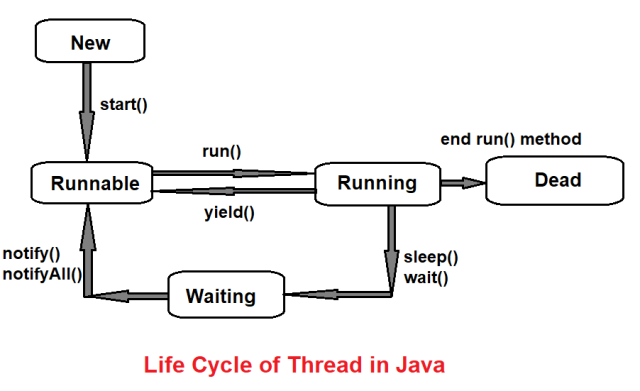

# Title: Core Java

- JDK --> JRE --> JVM

- JDK: Java Development Kit(converts it into byte code)
- JRE: Java RunTime Enviroment is inside JDK (provides extra necessary files required)
- JVM: Java Virtual Machine is inside JRE (executes your byte code)

_______________________________
## Data Allocation
- stores the data in the form of stack(local variables and also instance of methods) and heap(where objects are stored with reference address in that stack and with global variables in that class)

__________________________
## Arrays
- stores multiple values of same data types in a single variable.

- syntax: 
```Java 
int[] arr = {1, 2, 3};
int arr[] = {1, 2, 3};
int arr[] = new int[4] //where 4 is the size and is the fixed size of the array 
```
- we use 
```Java 
arr.length;
``` 
to find the length of the array

### Multi Dimentional array
- syntax:
```Java
int arr[][] = new int[3][4] 
```

### Jagged Array
- array with different sized rows
syntax:
```Java
    int arr[][] = new int[3][];
    arr[0] = new int[3];
    arr[1] = new int[4];
    arr[2] = new int[5];
```

### Array Objects

```Java
    class Student{
        int rollno;
        String name;
        int marks;
    }

    public class Demo{
        public static void main(String args[]){
        Student s1 = new Student();
        s1.rollno = 1;
        s1.name = "sai";
        s1.marks = 88;

        Student s[] = new Student[1];

        }
    }
```
______________________


## String
- collection of characters.
- String is Class not primitive type.
- once the String is created it cannot be changed which means it is immutable(creates a new String object when changed and changes its hashCode reference to the new String object).

Syntax: to find the length of the String we use
```Java
s.length();
```
some basic methods

```Java
a.concat(b);
s.charAt(1); //not s[1] returns only character at index 1
```


### if we want to use mutable Strings
### StringBuffer 
(gives us 16 extra space than our current String length)
- Syntax: 
```Java
 StringBuffer sb = new StringBuffer("sai");
 
 //to convert back to String
 sb.toString()
 ```

### StringBuilder()
- Syntax:
```Java
StringBuilder sb = new StringBuilder("Sai");
//to convert back to String
sb.toString()

```
_________________________
## diff b/w StringBuffer and StringBuilder
- StringBuffer is Thread Safe but StringBuilder is not Thread Safe.
- StringBuffer is slower than StringBuilder

______________________

### static keyword
- a variables that belongs to a class, not the instance of that class

- static variables are called directly with the class name not with the object name

- example: 
```java
class Mobile{
    String brand;
    int price;
    static String name;
}

public class Demo{
    public static void main(String args[]){
        Mobile mob = new Mobile();
        mob.brand = "Apple";
        mob.price = 1500;

        Mobile.name = "SmartPhone";
    }
}
```

### static method
- we can use only static variables in the static methods.

- static method can be directly called with the class name not with the object name. 

example:
```java
class Mobile{
    String brand;
    int price;
    static String name;

    public static void show1(){
        System.out.println(name);
    }
}

public class Demo{
    public static void main(String args[]){
        Mobile mob = new Mobile();
        mob.brand = "Apple";
        mob.price = 1500;
        Mobile.name = "SmartPhone";

        Mobile.show1();
    }
}
```

### static block

- a set of instructions that is run only once when a class is loaded into memory.

- Syntax:
```java 
class Mobile{
    String brand;
    int price;
    static String name;


    static{
        name = "Phone";
        System.out.println("in static block");
    }

    public Mobile(){
        brand = "";
        price = 200;
        System.out.println("in constructor");

    }
}
```
_________________________

## this keyword

- a reference variable that refers to the current object

- Example:
    without this keyword
```java
class Human{
    private int age;
    private String name;

    public int getAge(){
        return age;
    }

    public void setAge(int age, Human obj){
        Human obj1 = obj;
        obj1.age = age;
    }
    public String getName(){
        return name;
    }

    public void setName(String n){
        name = n;
    }

}

public class Demo{
    public static void main(String args[]) throws ClassNotFoundException{
        Human obj = new Human();
        obj.setAge(10, obj);
        obj.setName("sai");
        System.out.println(obj.getName() + " : " + obj.getAge());
    }
} 
```

with this keyword

```java 
class Human{
    private int age;
    private String name;

    public int getAge(){
        return age;
    }

    public void setAge(int age){
        this.age = age;
    }
    public String getName(){
        return name;
    }

    public void setName(String name){
        this.name = name;
    }

}

public class Demo{
    public static void main(String args[]) throws ClassNotFoundException{
        Human obj = new Human();
        obj.setAge(10);
        obj.setName("sai");
        System.out.println(obj.getName() + " : " + obj.getAge());
    }
}
```
## this method
- example:
```java
class A{

    public A(){
        super();
        System.out.println("in A");
    }

    public A(int n){
        super();
        System.out.println("in A int");
    }

}

class B extends A{
    public B(){
        super();
        System.out.println("in B");
    }

    public B(int n){
        this();
        System.out.println("in B int");
    }
}

public class Demo{
    public static void main(String args[]){
        B obj = new B(10);

    }
}
```

## super method 
- Example:
```java
class A extends Object{

    public A(){
        super();
        System.out.println("in A");
    }

    public A(int n){
        super();
        System.out.println("in A int");
    }

}

class B extends A{
    public B(){
        super(5);
        System.out.print("in B");
    }

    public B(int n){
        super(n);
        System.out.print("in B int");
    }
}

public class Demo{
    public static void main(String args[]){
        B obj = new B();
    
    }
}
```

## constructor
- it should be of same name as the class like a method 

example
```java 
class King{
    public King(){
    // default Constructor
        age = 12;
        name = "John" ;
    }

    public King(int age, String name){
        //parameterized constructor
        this.age = age;
        this.name = name;
    }
}
public class Demo{
    public static void main(String args[]){
        Human obj = new Human();//calling default Constructor
        Human obj = new Human(18, "Kaushik");//calling parameterized constructor
        System.out.println(obj.getName() + " : " + obj.getAge());
    }
}
```


## Naming conventions

- Camel casing

- class and interface - Calc, Runable

- variable and method - marks, show()

- constants - PIE, BRAND

- showMyMarks()
- MyData

- constructor - Bhai()

______________________
## packages
- a set of classes, interfaces, and sub-packages that are similar
### there are two types of packages:
- built-in packages
- user-defined packages

_______________________

## Access modifiers
<ol>
<li><b>public</b>: Within the class, Within the package, Outside the package but through child only, outside the package </li>
<li><b>private</b>: only within the class</li>
<li><b>default</b>: only Within the class and Within the package</li>
<li><b>protected</b>: only Within the class,  Within the package and Outside the package but through child only</li>
</ol>


|                    | Public | Protected | Default | Private |
|--------------------|--------|-----------|---------|---------|
|Same Class          | Yes    | Yes       | Yes     | Yes     |
|Same Package        | Yes    | Yes       | Yes     | No      |    
|Same Pack Sub Class | Yes    | Yes       | Yes     | No      |
|Diff Pack Sub CLass | Yes    | Yes       | No      | No      |
|Dif Pack No SubClass| Yes    | No        | No      | No      |

_________________________________

## final keyword
### final variable
once the final variable is created it cannot be changed.

Ex: 
```java 
final int s = 9;// it is 9 until the end 
```
### final class 
when the final keywod is used on class i.e 
```java 
final class A{
} 
```
then this final class cannot be inherited

### final method
when the final keyword is used on the method i.e
```java
class A{
   public final void show(){
    System.out.println("Sai");
   } 
}

class B extends A{
    public void show(){
        System.out.println("Kaushik");
    }
}

public class Demo{
    public static void main(String args[]){
        B b = new B(); 
        b.show();
    }
}
```
then we can prevent overriding from occuring.

________________________
## Type Casting:
```Java
public class Demo{
    public static void main(String args[]){
        double d = 4.5;
        int i = (int) d;
        System.out.println(i);
    }
 }
 ```

### Upcasting and Downcasting
<b>Upcasting:</b>
<ol>
    <li>Converting a subclass reference to a superclass reference </li>
    <li>Also known as widening or generalizing </li>
</ol>

<b>Downcasting: </b>
<ol>
<li>Converting a superclass reference to a subclass reference</li>
<li>Also known as narrowing or type refinement</li>
</ol>

Example:

```Java
class A{
    public void show1(){
        System.out.println("in A show");
    }
}

class B extends A{
    public void show2(){
        System.out.println("in B show");
    }
} 

 public class Demo{
    public static void main(String args[]){
        A obj = (A) new B();// UpCasting 
        obj.show1();

        B obj1 = (B) obj;// downCasting
        obj1.show2();
    }
 }

```
________________________
## Wrapper Classes
- Integer: The wrapper class for the primitive data type int
- Character: The wrapper class for the primitive data type char
- Double: The wrapper class for the primitive data type double


```Java
 public class Demo{
    public static void main(String args[]){
        int num = 7;
        Integer num1 = num; // autoboxing
        
        int num2 = num1.intValue(); // auto-unboxing
        System.out.println(num2);

        String str = "12";
        int i = Integer.parseInt(str);
        System.out.println(i * 4);
    }
 }
```
__________________
## Object Oriented Programming

### objects
- instance of a class
- anonymous objects
    - can be only be used once

    ```Java 
    new A();
    ```

``` Java
class Calc{
    public int add(int a, int b){
        int r = a + b;
        return r;
    }
}

public class Demo{
    public static void main(String args[]){
        int num1 = 4;
        int num2 = 5;
        Calc calc = new Calc();//object created for Calc
        int res = calc.add(num1, num2);
        
        System.out.println(res);
    }

}
```
__________________________
### classes

- blueprint for creating objects

- Inner class
```java
class A{
    int age;
    public void show(){
        System.out.println("in show");
    }
    class  B{
        public void config(){
            System.out.println("in config");
        }
    }
}
 public class Demo{
    public static void main(String args[]){
        A a = new A();
        a.show();
        
        A.B obj = a.new B();//to call the inner class
        obj.config();

    }
 }
```
- static can be used only for the inner class. 
- if B is a static inner class.

```java
class A{
    int age;
    public void show(){
        System.out.println("in show");
    }
    static class  B{
        public void config(){
            System.out.println("in config");
        }
    }
}
 public class Demo{
    public static void main(String args[]){
        A a = new A();
        a.show();

        A.B obj = new A.B();//can be called like this directly
        obj.config();

    }
 }
```

- Anonymous Inner Class:
syntax:
```java
A obj = new A()
        {
            public void show(){
                System.out.println("in new show");
            }
        };
obj.show();
```

```java

class A{
    public void show(){
        System.out.println("in A show");
    }
}


 public class Demo{
    public static void main(String args[]){
        A obj = new A()
        {
            public void show(){
                System.out.println("in new show");
            }
        };

        obj.show();

    }
 }
```

- using abstract method

```java
abstract class A{
    public abstract void show();
}

 public class Demo{
    public static void main(String args[]){
        A obj = new A(){
            
            public void show(){
                System.out.println("in new show");
            }
        };
        obj.show();
    }
 }
```

___________________________
### Encapsulation
- is a process of wrapping code and data together into a single unit.

- It provides you the control over the data.

- It is a way to achieve data hiding since it uses private keyword(which can be used within the class only).

- uses setter or getter method

Example:
```Java
class Human{
    private int age;
    private String name;

    public int getAge(){
        return age;
    }

    public void setAge(int a){
        age = a;
    }
    public String getName(){
        return name;
    }

    public void setName(String n){
        this.name = n;
    }

}

public class Demo{
    public static void main(String args[]) throws ClassNotFoundException{
        Human obj = new Human();
        obj.setAge(10);
        obj.setName("sai");
        System.out.println(obj.getName() + " : " + obj.getAge());
    }
}

```


________________________

### inheritance
- allows one class to inherit features from another class

- uses extends keyword

example:
```java
class Calc{
    public int add(int n1, int n2){
        return n1 + n2;
    } 

    public int sub(int n1, int n2){
        return n1 - n2;
    }
}

class AdvCal extends Calc{
    public int mul(int n1, int n2){
        return n1 * n2;
    }

    public int div(int n1, int n2){
        return n1 / n2;
    }
    
}

public class Demo{
    public static void main(String args[]){
        int i = 10;
        int j = 5;
        AdvCal adv = new AdvCal();
        System.out.println(adv.add(i, j) + " " + adv.sub(i, j) +" " + adv.mul(i, j) + " " + adv.div(i, j));
    }
}
```
- Types of inheritance
<ol>
<li>single inheritance :  A class inherits from only one parent class. </li>

<li>multi-level inheritance:  A class inherits from another class that is already the descendant of some other class.  </li>
<li>multiple inheritance(using interface)</li>
<li>Hierarchical inheritance:  Multiple classes inherit from a single superclass. </li>
<li>Hybrid inheritance</li>
</ol>

____________________________

### polymorphism

- run-time polymorphism(method overriding)(Late Binding)
- different classes, same method name


```Java
class Calc{
    public int add(int n1, int n2){
        return n1 + n2;
    }
}

class AdvCalc extends Calc{
    public int add(int n1, int n2){
        return n1 + n2 + 1;
    }
    
}

public class Demo{
    public static void main(String args[]){
        AdvCalc obj = new AdvCalc();
        int res = obj.add(10, 2);
        System.out.println(res);
    }
}
```

#### Dynamic Method Dispatch 
```Java

class A{
    public void show(){
        System.out.println("in A show");
    }
}
class B extends A {
    public void show(){
        System.out.println("in B show");
    }
}

class C extends A {
    public void show(){
        System.out.println("in C show");
    }
}
public class Demo{
    public static void main(String args[]){
        A obj = new A();
        obj.show();
        
        obj = new B();
        obj.show();
        
        obj = new C();
        obj.show();
        

    }
}
```

- compile-time polymorphism(method overloading)(Early Binding)
- same class, same method name, different parameters
```Java
// method overloading
class Calc{
    public int add(int a, int b){
        return a + b;
    }

    public int add(int a, int b, int c){
        return a + b + c;
    }


}
public class Demo{
    public static void main(String args[]){
        Calc calc = new Calc();
        int res = calc.add(10, 20);
        System.out.println(res);
    }

}
```

_____________________________________
### Abstract keyword
- is used to create a abstract class and method.(i.e if you create a abstract method then it should be in abstract class only)

- if other class extends abstract class then there should be abstract method in that extended class.

- Abstract class cannot be called it should have a sub class to call it.

- Abstract class can also contain non abstract methods also.

```Java
abstract class Car {
    public abstract void drive();

    public void playMusic(){
        System.out.println("play music");
    }
}

class WagonR extends Car {
    public void drive(){
        System.out.println("driving WagonR");
    }
}

 public class Demo{
    public static void main(String args[]){
        WagonR obj = new WagonR();
       obj.drive();
       obj.playMusic();


    }
 }
```

### Abstraction
- Hiding internal implementation and showing functionality only to the user 

__________________________
### interfaces
- all the variables in the interfaces are final and static.

- interfaces are not classes and only contain abstract methods.

- to extend interfaces with interfaces we use extends keyword

- syntax

```java
interface X{
    public abstract void run();
}

interface Y extends X{
}

```


- uses implements keyword to implement through a class(can implement multiple interfaces)


- syntax:
```java
interface A{
    public abstract void show();
    public abstract void config();
}
interface X{
    public abstract void run();
    
}
class B implements A, X{
    public void show(){
        
    }
    public void config(){

    }
    public void config(){

    }
}
```


```java
interface A{
    int age = 44; //final and static
    String area = "Bombay";
    
    public abstract void show();
    public abstract void config();
}
class B implements A {
    public void show(){
        System.out.println("in show");
    }
    public void config(){
        System.out.println("in config");
    }
    
}
 public class Demo{
    public static void main(String args[]){
        A obj = new B();
        obj.show();
        obj.config();
        System.out.println(A.area);

    }
 }
```

#### Types of Interface
- Normal
- Functional Interface / Simple Abstract method(only one method)
- Marker Interface(no mathods in this interface)
________________________________________

### Anotations

```java
class A{
    
    public void showTheDataWhichBelongsToThisClass(){
        System.out.println("in A show");
    }
}

class B extends A{
    @Override //anotation
    public void showTheDataWhichBelongsToThisClass(){
        System.out.println("in B show");
    }
}

public class Demo {

    public static void main(String[] args){
        B obj = new B();
        obj.showTheDataWhichBelongsToThisClass();
    }
}
```

_________________________________________
### Enumerate(enum):

- we cannot extend enum class. otherwise it acts like a class

```java
enum Laptop{
    Macbook(2000), XPS(2200), Surface, Lenovo(1800);
    
    private int price;

    private Laptop() {
        this.price = 500;
    }

    private Laptop(int price) {
        this.price = price;
    }

    public int getPrice() {
        return price;
    }

    public void setPrice(int price) {
        this.price = price;
    }

}

 public class Demo{
    public static void main(String args[]){
        //Laptop lap = Laptop.values();
        for(Laptop lap: Laptop.values()){
            System.out.println(lap + ": "+lap.getPrice());
       }
    }
 }
 ```


 ## Lambda Expression
- can be used in interfaces

example:
```java
//lamda without return
@FunctionalInterface
interface A{
    public abstract void show();
}

public class Demo {

    public static void main(String[] args){
        A obj = () -> System.out.println("in show");//using lambda
        obj.show();
    }
}
```

```java
//lambda with return 

@FunctionalInterface
interface A{
    public abstract int add(int i, int j);
}

public class Demo {

    public static void main(String[] args){
        A obj = (i, j) -> i + j;
        
        
        int res = obj.add(5, 10);
        System.out.println(res);
    }
}
```


_______________________________________

## Exceptions 
Run time errors are called Exceptions
types
- RunTIme Exceptions(Unchecked Exceptions)
    - can be handled

    - ArithmeticException
    - ArrayIndexOutOfBoundsException
    - NullPointerException

- Checked Exceptions
    - cannot be handled

    - IO Exception
    - SQL Exception

### Exception Handling
- try(): If an exception occurs at the particular statement in the try block, the rest of the block code will not execute
- catch(): is used to handle the Exception
- finally(): code in this block will run even if there are exceptions or not(mostly used for closing files at the end).
- throw: it is used to throwing exception using our own Exceptions
- throws: ducking the exception that method i.e doesnot stop


```java 
public class Demo {

    public static void main(String[] args){
        int i = 0;
        int j = 0;

        try{
            j = 18 / i;
        }
        catch(Exception e){
            System.out.println("Zero Division Error");

        }

        System.out.println(j);
        System.out.println("Bye");
    }
}
```


_______________________________

## Threads
- we can perform multiple tasks activities within a single process.
- Lightweight process.

- built-in methods
    - a.start();
    - a.setPriority(Thread.MAX_PRIORITY)
    - a.getPriority();
    - Thread.sleep(10);


- syntax:
```java
class A extends Thread{
    public void run(){

    }
}
class B extends Thread{
    public void run(){

    }
}
public class Demo{
    public static void main(String[] args){
        A a = new A();
        B a = new B();
        a.start();
        b.start();

    }
}
```

if a.start() there should be a run() method in class A.

## Runnable
- interface 

```java


/**class A implements Runnable{
    public void run(){
        for(int i = 1; i < 5; i++){
            System.out.println("hi");
            try {
                Thread.sleep(10);
            } catch (InterruptedException e) {
                // TODO Auto-generated catch block
                e.printStackTrace();
            }
        }
    }
}

class B implements Runnable{
    public void run(){
        for(int i = 1; i < 5; i++){
            System.out.println("hello");
            try {
                Thread.sleep(10);
            } catch (InterruptedException e) {
                e.printStackTrace();
            }
            
        }
    }
}**/


public class Demo {

    public static void main(String[] args){
        Runnable a = () -> {
            for(int i = 1; i < 1000; i++){
                System.out.println("hi");
                try {
                    Thread.sleep(10);
                } catch (InterruptedException e) {
                    e.printStackTrace();
                }
                
            }
        };
        
        Runnable b = () -> {
            for(int i = 1; i < 5; i++){
                System.out.println("hello");
                try {
                    Thread.sleep(10);
                } catch (InterruptedException e) {
                    e.printStackTrace();
                }
                
            }
        };

        Thread t1 =  new Thread(a);
        Thread t2 =  new Thread(b);
        

        t1.start();
        t2.start();
        
        
    }
}
```

## Race condition
- occurs when multiple threads try to access the same resource simultaneously
- Multiple threads accessing shared data without synchronization

```java
class Counter
{
    int count;
    public void increment(){
        count++;
    }
}


public class Demo {

    public static void main(String[] args) throws InterruptedException{
        Counter c = new Counter();
        
        Runnable a = () -> {
            for(int i = 1; i < 1000; i++){
                c.increment();
            }
        };
        
        Runnable b = () -> {
            for(int i = 1; i < 1000; i++){
                c.increment();
            }
        };

        Thread t1 =  new Thread(a);
        Thread t2 =  new Thread(b);
        

        t1.start();
        t2.start();

        t1.join();
        t2.join();
        
        
        System.out.println(c.count);
        
    }
}
```

- for syncronized
```java
class Counter
{
    int count;
    public synchronized void increment(){
        count++;
    }
}
```


## Thread states


__________________________________________
## Collections

- uses generic classes <>

- ArrayList
    - nums.get(0)//returns nums[0]
    - nums.indexOf(10)// returns index of 10 in list

- Set
    - HashSet<>()
    - for sorted set we can use TreeSet<>();

- HashMap
    - key values pairs
    ```java

    import java.util.*;
    public class Demo {

    public static void main(String[] args) {
        HashMap<String, Integer> students = new HashMap<>();
        students.put("sai", 10);
        students.put("kaushik", 9);
        students.put("anna", 8);
        System.out.println(students.keySet());

        for(String i: students.keySet()){
            System.out.println(i + ":" + students.get(i));
        }

    }

    ```
_______________________________

## comparable and comaparator

comparable interface when impleted by other classes should contain compareTo method in that class.

comparator
```java
    Comparator<Integer> com = new Comparator<Integer>() {
            public int compare(Integer i, Integer j){
                return i > j ? 1:-1;
            }
        };

```


comparable

```java
import java.util.*;


class Student implements Comparable<Student>{

    int age;
    String name;

    public Student(int age, String name){
        this.age = age;
        this.name = name;
    }

    public String toString(){
        return "sname: "+ name + ", " +"age: "+ age;
    }

    public int compareTo(Student that){
        if(this.age > that.age){
            return 1;
        }
        else{
            return -1;
        }
    }

}
public class Demo {

    public static void main(String[] args) throws InterruptedException{
        Comparator<Student> comp = (Student i, Student j) -> i.age > j.age ? 1:-1;

        List<Student> n = new ArrayList<>();
        n.add(new Student(21, "sai"));
        n.add(new Student(11, "kaushik"));
        n.add(new Student(12, "bhai"));
        n.add(new Student(71, "anna"));

        Collections.sort(n, comp);
        System.out.println(n);


    }
}
```
_______________________________________________
- forEach:
    - syntax:
    ```java
    nums.forEach(n -> System.out.println(n));
    ```
______________________________
## stream 
each stream can only be used once

## Stream

-  It is used to simplify List operations in Java

- Like javascript to use filter, map, reduce or so one features n list objects we use the stream

- One major takeaway is stream objects are single time usable objects

- When we do operations on stream objects they return a stream as well.


```java
List<Integer> nums = new ArrayList<>();
        
nums.add(70);
nums.add(96);
nums.add(33);
nums.add(18);
nums.add(16);

System.out.println(nums);

// To get sum of even numbers after doubling there values 
List<Integer> resNums = nums.stream()
.filter( n -> n%2==0)
.map(n -> n*2)
.toList();

System.out.println(resNums);
// reduce(initial value, (accumulator, current element) -> (operation));
int total = resNums.stream().reduce(0,(acc,ele) -> acc+ele);

System.out.println(total);

```

_________________

## Parallel Stream

- To use filter or map kind of methods using multi-thread instead of Single thread

- Parallel Stream is useful generally on large data (>10^4)


```java

List<Integer> nums = new ArrayList<>();

Random ran = new Random();

for(int i = 0; i < 10000; i++){
    nums.add(ran.nextInt(100));
}

// Stream
long startSTime = System.currentTimeMillis();
int sum = nums.stream()
.mapToInt(n -> n*2)
.sum();
long endSTime = System.currentTimeMillis();


System.out.println("Stream total: "+ sum +" in Time(millisecs): " + (endSTime-startSTime));
// Output - Stream total: 982536 in Time(millisecs): 7


System.out.println();
// Parallel Stream
long startPTime = System.currentTimeMillis();
int sum1 = nums.parallelStream()
.mapToInt(n -> n*2)
.sum();
long endPTime = System.currentTimeMillis();

System.out.println("Parallel Stream total: "+ sum1 +" in Time(millisecs): " + (endPTime-startPTime));
// Output - Parallel Stream total: 982536 in Time(millisecs): 3

```


# Optional class 

- It is used to avoid the 'null point exception' in the java code


```java
List<String> names = List.of("Bhuvan", "Keerthi", "Nani", "Meenu");

// To find if there is name with "M" in it.

Optional<String> name = names.stream()
.filter( n -> n.contains("M"))
.findFirst();

System.out.println(name.orElse("Not Found any name with 'M'"));
```


- When we use findFirst() for a stream we get a Optional class so to reduce we could use .orElse() or get() after the findFirst() method.

```java
List<String> names = List.of("Bhuvan", "Keerthi", "Nani", "Meenu");

// To find if there is name with "M" in it.
String name = names.stream()
// For char insensitive check 
.filter( n -> n.toLowerCase().contains("M".toLowerCase())) 
.findFirst()
.orElse("Not Found any name with 'M'");

System.out.println(name);
```